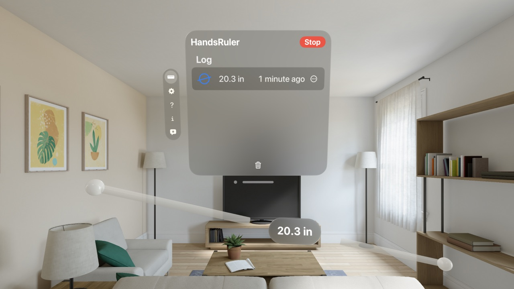
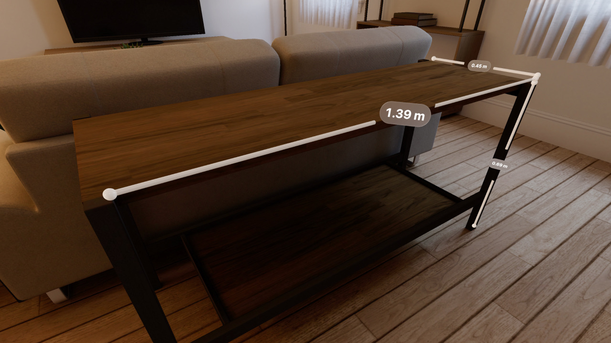

<h1 translate="no">HandsRuler</h1>

_両手で距離を直感的に測る物差しアプリ。_

Apple Vision Pro向け。

<iframe width="560" height="315" src="https://www.youtube.com/embed/_kAL5OXHVvQ?si=wvoV58O3s0xPq208" title="YouTube video player" frameborder="0" allow="accelerometer; autoplay; clipboard-write; encrypted-media; gyroscope; picture-in-picture; web-share" referrerpolicy="strict-origin-when-cross-origin" allowfullscreen></iframe>

概要
----------
両手を使って直感的に距離を測定！

両手の人差し指の先端同士の距離を表示します。

### 単位オプション

- センチメートル(cm)

- メートル(m)

- インチ(in)

- フィート(ft)

- ヤード(yd)

- フィートとインチ

### おまけ機能

- ポインターを間接タップして位置を固定。

- 複数測定機能。

- ログ機能。

* * *

仕様
-------
### 価格
無料

### App Store リンク
[https://apps.apple.com/app/id6475769879](https://apps.apple.com/app/id6475769879)

<!--

-->
