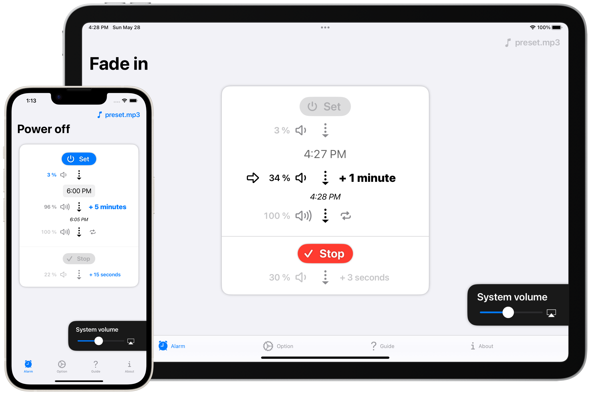

Portfolio
==========

[__PlainShogiBoard(Plain将棋盤)__](Plain将棋盤)

将棋盤アプリ。SharePlay対応。 Shogi board app. Support SharePlay.

[日本語(native)](Plain将棋盤/ja)
[English](Plain将棋盤/en)
[Indonesia](Plain将棋盤/id)
[Español](Plain将棋盤/es)
[Deutsch](Plain将棋盤/de)
[Français](Plain将棋盤/fr)
[Português](Plain将棋盤/pt)
[Русский](Plain将棋盤/ru)
[中文](Plain将棋盤/zh)
[Українська](Plain将棋盤/uk)
[한국어](Plain将棋盤/ko)

* * *

[__FlipByBlink__](FlipByBlink)

まばたきだけで読書ができる電子書籍アプリ。 E-book reader app with eye blink.

* * *

[__TapWeight__](TapWeight)

iPhoneにプリインストールされている「ヘルスケア」アプリに体重データを(手動としては)最速で登録するためのアプリ

Register weight data to the Apple "Health" app pre-installed on iPhone in the fastest possible way (as manual).

* * *

[__TapTemperature__](TapTemperature)

iPhoneにプリインストールされている「ヘルスケア」アプリに体温データを(手動としては)最速で登録するためのアプリ

Register body temperature data to the Apple "Health" app pre-installed on iPhone in the fastest possible way (as manual).

* * *

[__MemorizeWidget__](MemorizeWidget)

ホーム画面やロック画面を暗記帳にするアプリ。 Flashcard app for widget.

* * *

[__LockInNote__](LockInNote)

「ロック画面ウィジェット」に特化したノートアプリ。 Memo note app specialized for lock screen widgets.

* * *

[__FadeInAlarm__](FadeInAlarm)

時間をかけて少しずつ音が大きくなるアラームアプリ。 Alarm clock with taking a long time from small volume to max volume.

