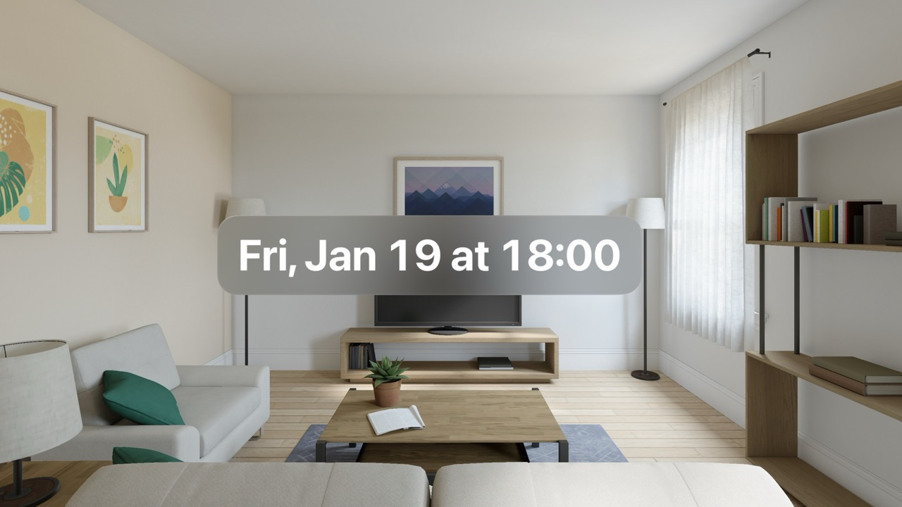
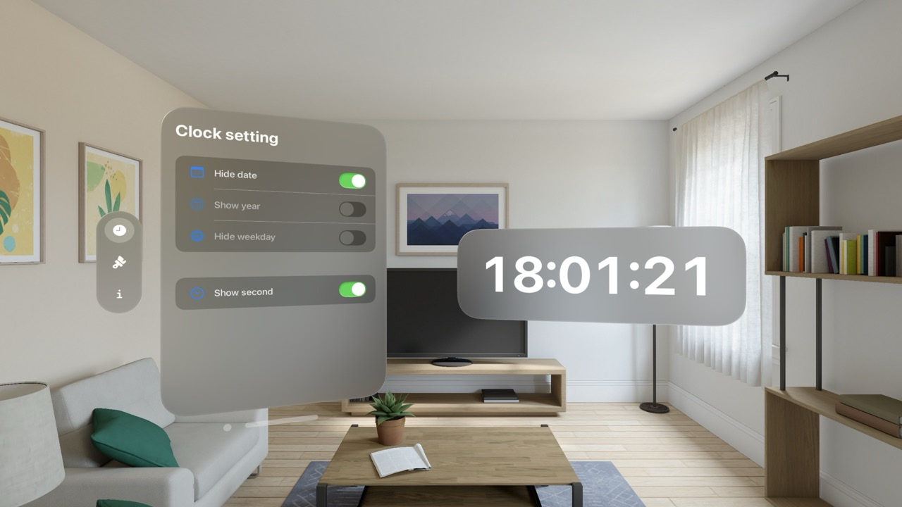
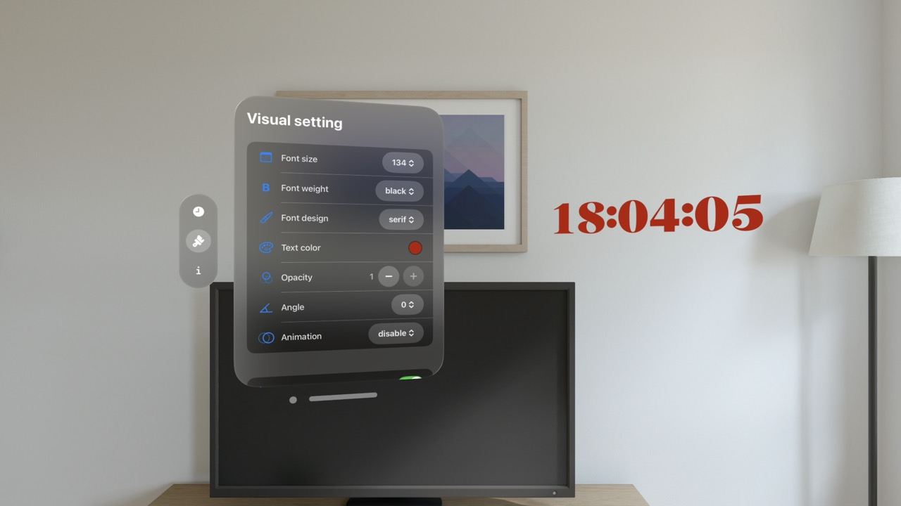
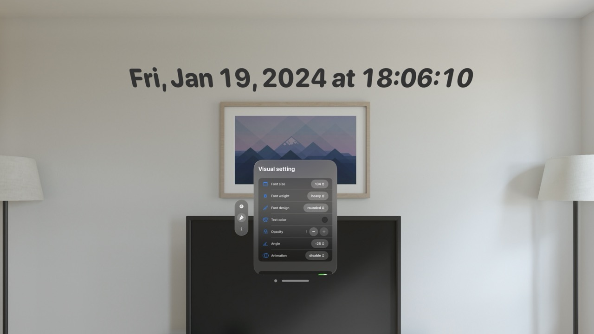

<h1 translate="no">SpatialClock</h1>

_空間コンピューティング用の置き時計アプリ。_

Apple Vision Pro向け。

概要
----------
共有スペース向けの置き時計です。

シンプルなデザイン。軽量。

### オプション

- 「日付」を隠す

- 「年」を表示

- 「曜日」を隠す

- 「秒」を表示

- 背景を隠す

- フォントをカスタマイズ

* * *

仕様
-------
### 価格
無料

### App Store リンク
[https://apps.apple.com/app/id6476141176](https://apps.apple.com/app/id6476141176)

<!--

-->
