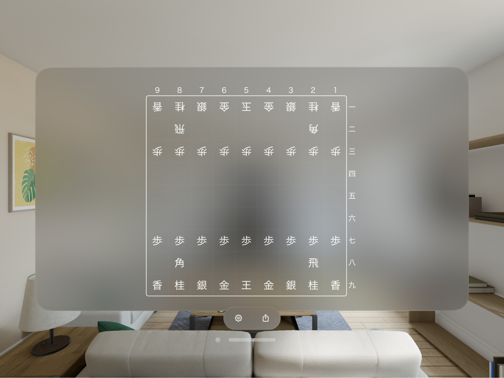
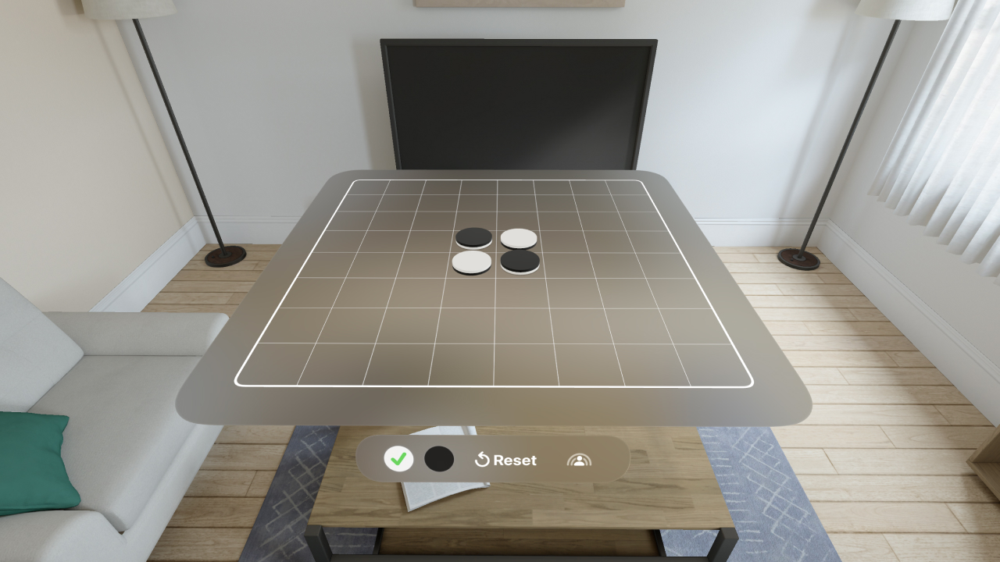

山下亮がリリースしたApple Vision Proアプリ一覧
=========================================

HandsRuler
----------
_両手で距離を直感的に測定できるAR物差しアプリ_

<iframe src="https://www.youtube.com/embed/_kAL5OXHVvQ?si=wvoV58O3s0xPq208" title="YouTube video player" frameborder="0" allow="accelerometer; autoplay; clipboard-write; encrypted-media; gyroscope; picture-in-picture; web-share" referrerpolicy="strict-origin-when-cross-origin" allowfullscreen></iframe>

[App Store製品ページを開く](https://apps.apple.com/app/id6475769879)

 

Plain将棋盤
----------
_標準デザインに準拠したシンプルかつ軽量で多機能な将棋盤アプリ_

<iframe width="560" height="315" src="https://www.youtube.com/embed/Wu50RDAKCQA?si=sUo2ZhPzX1GDfRWi" title="YouTube video player" frameborder="0" allow="accelerometer; autoplay; clipboard-write; encrypted-media; gyroscope; picture-in-picture; web-share" referrerpolicy="strict-origin-when-cross-origin" allowfullscreen></iframe>

[App Store製品ページを開く](https://apps.apple.com/app/id1620268476)

 

SpatialClock
-------------
_置き時計アプリ_

[App Store製品ページを開く](https://apps.apple.com/app/id6476141176)

 

PersonaChess
-------------
_空間SharePlayによるマルチプレイに対応したチェスアプリ_

[App Store製品ページを開く](https://apps.apple.com/app/id6482994319)

 

PersonasFlip
--------------
_空間SharePlayによるマルチプレイに対応したリバーシアプリ_

[App Store製品ページを開く](https://apps.apple.com/app/id6480587175)

* * *

更新日: 2025/08/18
