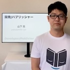

求職要項
========
簡易的ではありますが、求職事項を載せています。

興味ある方は下記メールアドレスへご連絡ください。2〜3日以内に返信します。ちょっとした質問や相談でも構いません。

## メールアドレス
06swan-synth@icloud.com

## ポートフォリオ
iPhoneアプリ中心に個人でアプリ開発をしています。詳しくは下記ポートフォリオサイトを参照してください。

[__ポートフォリオサイト__](https://flipbyblink.github.io/Portfolio/forAJob)

## 想定職種
### 高優先度
- iPhone/iPadアプリエンジニア
- Apple Vision Proアプリエンジニア
- Apple Watchアプリエンジニア

### 低優先度
- Macアプリエンジニア
- Apple TVアプリエンジニア
- Androidアプリエンジニア(未経験)

## 勤務地
リモートワークへの関心が強いです。

### オフィス出勤
日本であればどこでも検討できますが、条件は少し厳しくなります。

### リモートワーク
可能です。現住所からのフルリモートが出来ると嬉しいです。

### 現住所
岡山県岡山市

## 事業分野
- 強いこだわりはありません。
- 価値のあるプロダクトを手掛ける会社に関心があります。
- 受託開発より内製開発に関心があります。
- BtoBアプリや業務アプリへの関心があります。

### NG
- FinTech業
- 広告業
- 求人/採用/人材業
- マッチングアプリ業
- 企業倫理低い企業

## 想定年収
400万 〜 800万

## 時期
特に縛りはありません。すぐに就労する事も可能です。

## カジュアル面談
ZoomなどでWeb上でのカジュアル面談できます。

## プロフィール

### 名前
山下 亮 (やました りょう)

### 年齢
だいたい30歳

### 学歴
日本の大学の工学部情報工学科を卒業

### エンジニアリングスキルセット
[PDFを開く](/Asset/engineeringSkillSet.pdf)

## 更新日
2024/06/09
