山下亮のポートフォリオ
==================
iPhone中心にAppleプラットフォーム向けアプリを開発/公開しています。全作業を自分1人で行なっています。

各アプリは無料で利用できます。ぜひ実際にアプリをインストールして触れてみて下さい。

* * *

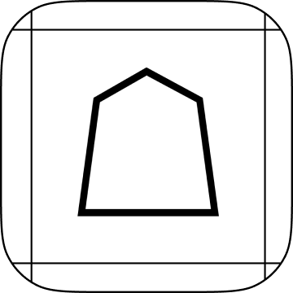

### Plain将棋盤
__全てのAppleプラットフォームに対応__

OS標準デザインに準拠したシンプルかつ軽量で多機能な将棋盤アプリ

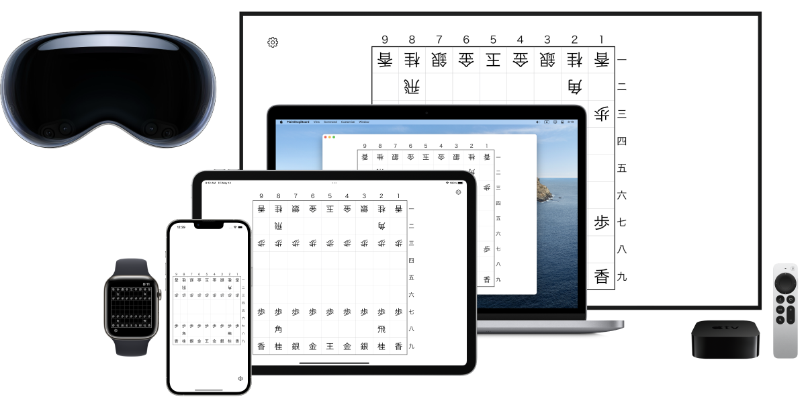

SwiftUIのポテンシャルを最大限活かしました。各プラットフォームに対してそれぞれしっかりと最適化を行った上で、全てのAppleプラットフォーム(iPhone/iPad/Mac/Apple TV/Apple Watch/Apple Vision Pro)へリリースしました。

SharePlayに対応しているので遠くの友人とも近くの家族とも将棋盤を囲むことが出来ます。

初版リリース: 2022年4月21日

主要フレームワーク: SwiftUI, GroupActivities

[__App Storeリンク__](https://apps.apple.com/app/id1620268476)

[PRページリンク](Plain将棋盤/ja)

[ソースコードリンク(GitHub)](https://github.com/FlipByBlink/PlainShogi)

* * *

### 暗記ウィジェット(iPhone/iPad/Mac/Apple Watch)
ホーム画面やロック画面、デスクトップ、文字盤を暗記帳にするアプリ

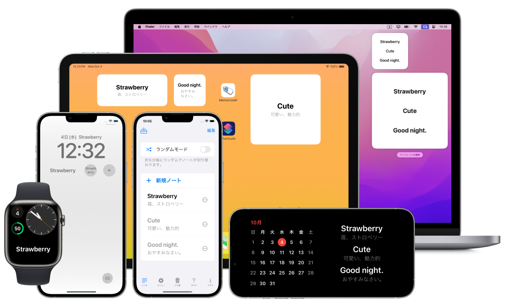

世界中のユーザーから非常に高い評価を得ており、ヘビーユーザーを一定数獲得しています。

初版リリース: 2022年9月9日

主要フレームワーク: SwiftUI, WidgetKit

[__App Storeリンク__](https://apps.apple.com/app/id1644276262)

[PRページリンク](MemorizeWidget/ja)

[ソースコードリンク(GitHub)](https://github.com/FlipByBlink/MemorizeWidget)

* * *

### HandsRuler(Apple Vision Pro)
両手で距離を直感的に測定できるAR物差しアプリ

<iframe width="560" height="315" src="https://www.youtube.com/embed/_kAL5OXHVvQ?si=wvoV58O3s0xPq208" title="YouTube video player" frameborder="0" allow="accelerometer; autoplay; clipboard-write; encrypted-media; gyroscope; picture-in-picture; web-share" referrerpolicy="strict-origin-when-cross-origin" allowfullscreen></iframe>

 

Appleにとって新たなカテゴリのデバイスであるApple Vision Pro向けにアプリを開発しました。Apple Vision Pro発売と同時リリースしました。このデバイスの強みである「正確な空間把握」や「ハンドトラッキング」、「アイトラッキング」などを活かしています。

初版リリース: 2024年2月2日

主要フレームワーク: ARKit, RealityKit, SwiftUI

[__App Storeリンク__](https://apps.apple.com/app/id6475769879)

[ソースコードリンク(GitHub)](https://github.com/FlipByBlink/HandsRuler)

* * *

### FlipByBlink(iPhone/iPad)
まばたきだけで読書ができるハンズフリー電子書籍アプリ

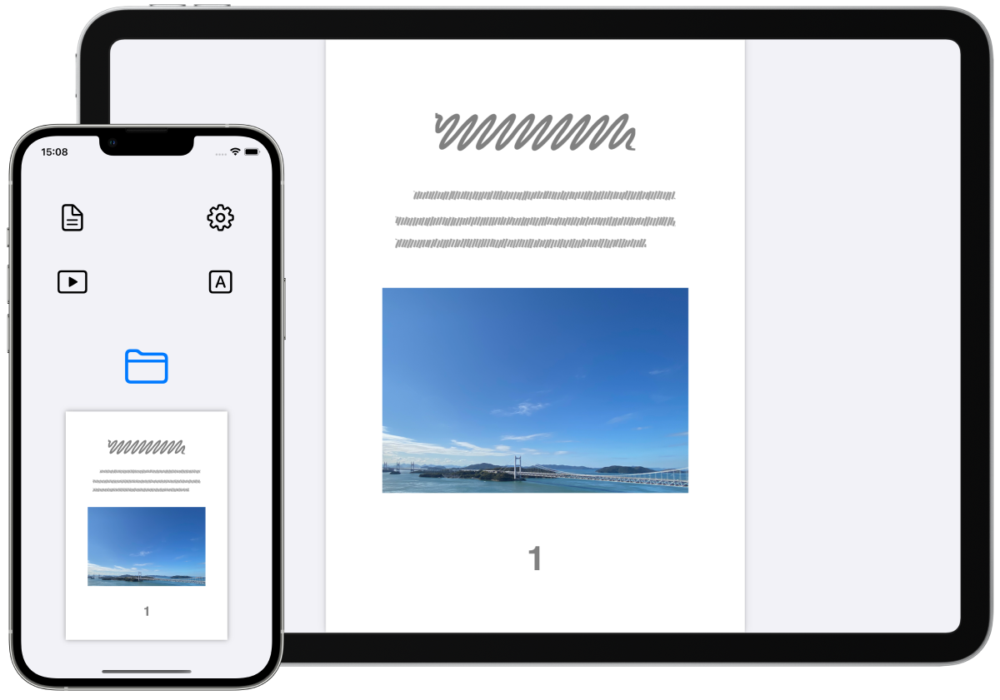

<video controls width="560" src="FlipByBlink/concept video.mp4">
      Sorry, your browser doesn't support embedded videos.
</video>

大学の卒業研究の成果物です。

初版リリース: 2019年1月15日

主要フレームワーク: UIKit, Auto Layout, ARKit, PDFKit

[__App Storeリンク__](https://apps.apple.com/app/id1444571751)

[PRページリンク](FlipByBlink/ja)

[ソースコードリンク(GitHub)](https://github.com/FlipByBlink/FlipByBlink_ver3)

* * *

### 体重登録(iPhone/iPad/Apple Watch)
iPhoneやiPadにプリインストールされている「ヘルスケア」アプリに体重データを(手動としては)最速で登録するためのアプリ

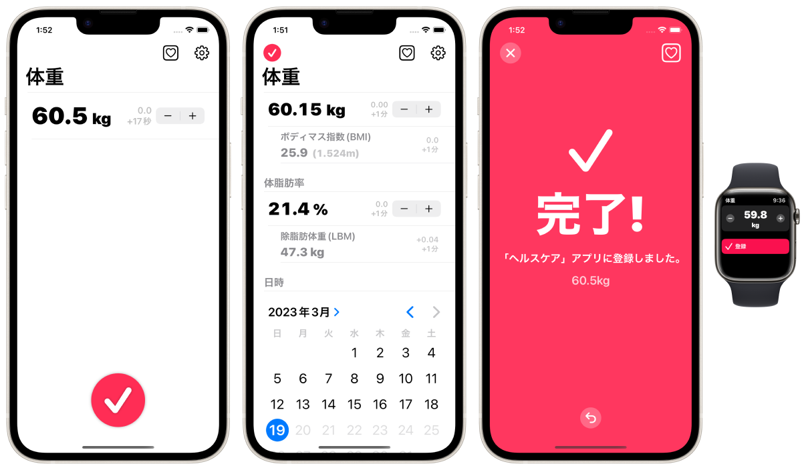

同コンセプトのアプリはApp Storeに多く存在するが、本アプリは同コンセプトにおいて機能面/デザイン面でベストであると自負しています。

初版リリース: 2022年5月23日

主要フレームワーク: SwiftUI, HealthKit

[__App Storeリンク__](https://apps.apple.com/app/id1624159721)

[ソースコードリンク(GitHub)](https://github.com/FlipByBlink/TapWeight)

* * *

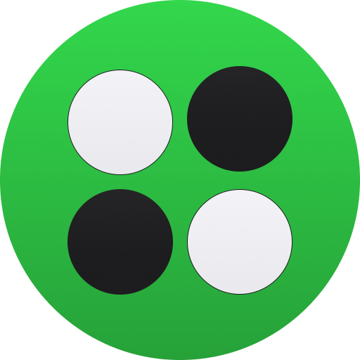

### PersonaReversi(Apple Vision Pro)
空間SharePlayに対応したリバーシアプリ

[__App Storeリンク__](https://apps.apple.com/app/id6480587175)

[ソースコードリンク(GitHub)](https://github.com/FlipByBlink/PersonaReversi)

* * *

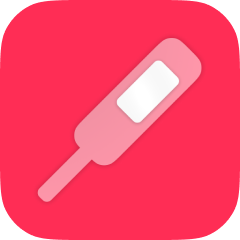

#### 体温登録(iPhone/iPad/Apple Watch)
iPhoneやiPadにプリインストールされている「ヘルスケア」アプリに体温データを(手動としては)最速で登録するためのアプリ

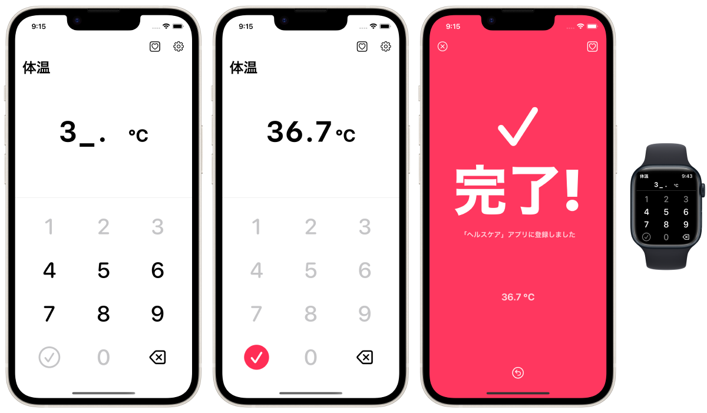

[App Storeリンク](https://apps.apple.com/app/id1626760566)

* * *

#### ロックノート(iPhone/iPad/Mac/Apple Watch)
「ウィジェット」に特化した超軽量なノートアプリ

[App Storeリンク](https://apps.apple.com/app/id1644879340)

* * *

#### FadeInAlarm(iPhone/iPad)
時間をかけて少しずつ音が大きくなるアラームアプリ

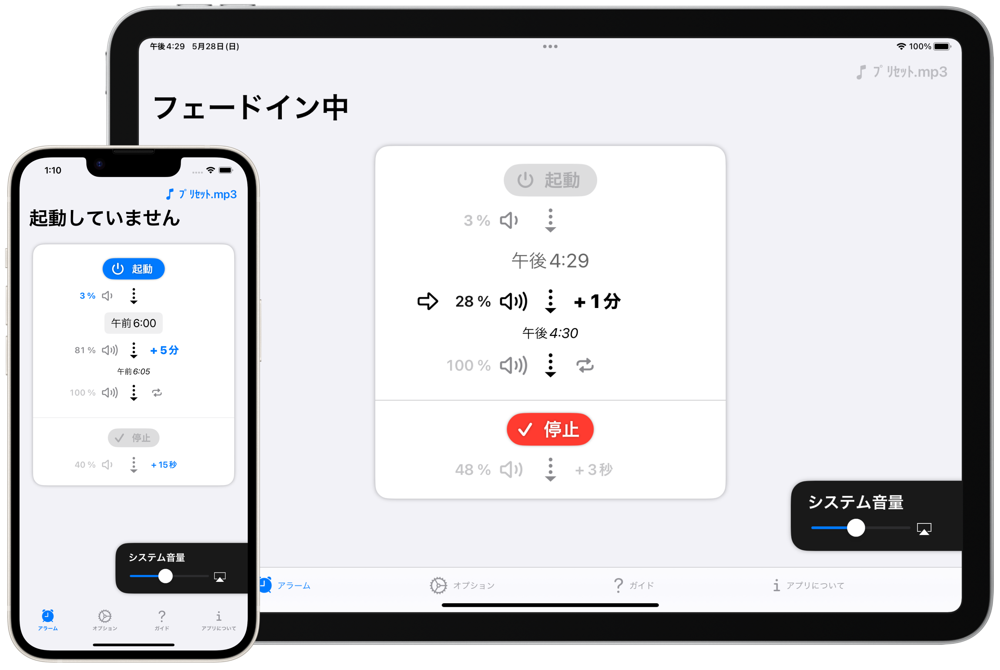

[App Storeリンク](https://apps.apple.com/app/id1465336070)

* * *

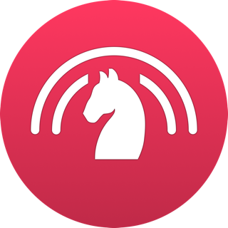

#### PersonaChess(Apple Vision Pro)
空間SharePlayに対応したチェスアプリ

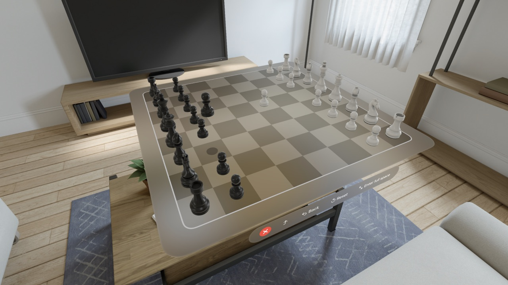

[App Storeリンク](https://apps.apple.com/app/id6482994319)

* * *

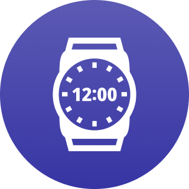

#### SpatialClock(Apple Vision Pro)
空間コンピューティング用の置き時計アプリ

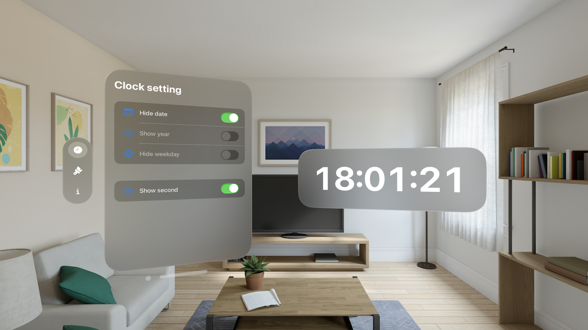

[App Storeリンク](https://apps.apple.com/app/id6476141176)

* * *

## ソースコード公開
アプリのソースコードはGitHub上で全て公開しています。

[GitHubアカウントページリンク](https://github.com/FlipByBlink)

* * *

## 技術ブログ記事
[「残念な」iPadアプリをわずかな修正で折り合いをつけるテクニック2選](https://zenn.dev/huiygfutfgvjknj/articles/eea68b91b7306c)

[中華フォントをたった1行で解決するtypesettingLanguage【SwiftUI】 - Qiita](https://qiita.com/mjnfhbuvwebwfiejcnw/items/2e6c3cdec8b2934e9e99)

[非日本語圏日本語フォント問題、SwiftUIにおける対処事例(2023年中旬) - Qiita](https://qiita.com/mjnfhbuvwebwfiejcnw/items/c9961f8ba6c366953752)

[iPhoneアプリをiPad対応するノリでMac対応しよう【SwiftUI】 - Qiita](https://qiita.com/mjnfhbuvwebwfiejcnw/items/df8ca3b867b0708226b6)

[Mac Catalystアプリを良い感じにする固有テクニック2(+6)選](https://zenn.dev/huiygfutfgvjknj/articles/67072b942d767c)

[Apple Vision Proアプリを発売日に3つリリースした話 - Qiita](https://qiita.com/mjnfhbuvwebwfiejcnw/items/90d6e1b312d36cf085c4)

[空間ペルソナのSharePlayに対応したアプリを2つリリースした話 - Qiita](https://qiita.com/mjnfhbuvwebwfiejcnw/items/498ad1878dd48ea53412)

[全Appleプラットフォームでリリースしてきた将棋盤アプリをvisionOSにも対応した話](https://zenn.dev/huiygfutfgvjknj/articles/9990f9ee42a410)

[visionOSアプリをApp Storeで公開する方法 #AppStore - Qiita](https://qiita.com/mjnfhbuvwebwfiejcnw/items/63f88dd739537f35c7fa)

[Appleが教えてくれないvisionOSアプリ開発に必要な知識集(2024春)](https://zenn.dev/huiygfutfgvjknj/articles/134014540063e9)

[visionOSアプリ開発ドキュメントの公式日本語翻訳が良い感じに充実してる件について](https://qiita.com/mjnfhbuvwebwfiejcnw/items/5a9cc87c5570187131cc)

* * *

更新日: 2024/08/25
