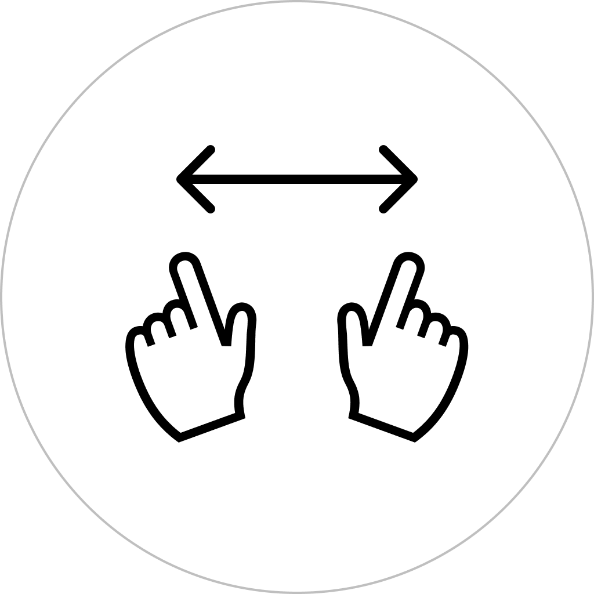
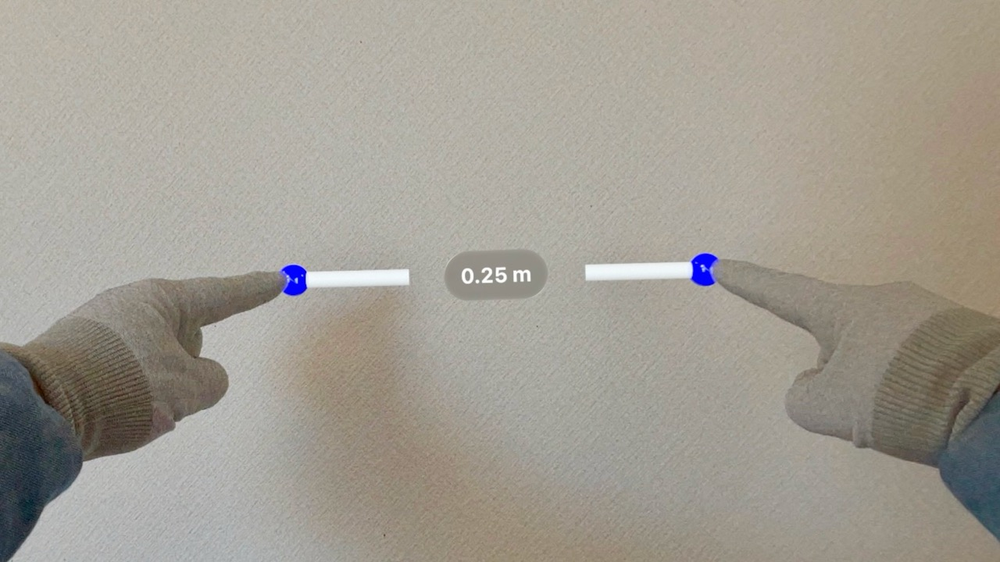

ポートフォリオ
============

iPhoneを中心にAppleプラットフォーム向けにアプリを制作しています。全ての作業を自分1人で行っています。

各アプリは無料で利用できます。ぜひ実際にアプリをインストールして触れてみて下さい。

* * *

### Plain将棋盤

iPhone / iPad / Mac / Apple TV / Apple Watch / Apple Vision Pro 向け

OS標準デザインに準拠したシンプルかつ軽量で多機能な将棋盤アプリ

SwiftUIのポテンシャルを最大限活かす様に実装。SharePlayにも対応。

各プラットフォームに対してそれぞれ最適化を行った上で、全てのAppleプラットフォームへリリース。

主要フレームワーク: SwiftUI, GroupActivities

[__AppStoreリンク__](https://apps.apple.com/app/id1620268476)

[PRページリンク](Plain将棋盤/ja)

* * *

### 体重登録

iPhone / iPad / Apple Watch 向け

iPhoneやiPadにプリインストールされている「ヘルスケア」アプリに体重データを(手動としては)最速で登録するためのアプリ

同コンセプトのアプリはAppStoreに沢山ありますが、本アプリは同コンセプトにおいて機能面/デザイン面でベストであると自負。

主要フレームワーク: SwiftUI, HealthKit

[__AppStoreリンク__](https://apps.apple.com/app/id1624159721)

[PRページリンク](TapWeight/ja)

* * *

### 体温登録

iPhone / iPad / Apple Watch 向け

iPhoneやiPadにプリインストールされている「ヘルスケア」アプリに体温データを(手動としては)最速で登録するためのアプリ

主要フレームワーク: SwiftUI, HealthKit

[__AppStoreリンク__](https://apps.apple.com/app/id1626760566)

[PRページリンク](TapTemperature/ja)

* * *

### 暗記ウィジェット

iPhone / iPad / Mac / Apple Watch 向け

ホーム画面やロック画面、デスクトップを暗記帳にするアプリ

主要フレームワーク: SwiftUI, WidgetKit

[__AppStoreリンク__](https://apps.apple.com/app/id1644276262)

[PRページリンク](MemorizeWidget/ja)

* * *

### ロックノート

iPhone / iPad / Mac / Apple Watch 向け

「ウィジェット」に特化した超軽量なノートアプリ

主要フレームワーク: SwiftUI, WidgetKit

[__AppStoreリンク__](https://apps.apple.com/app/id1644879340)

[PRページリンク](LockInNote/ja)

* * *

### FlipByBlink

iPhone / iPad 向け

まばたきだけで読書ができる電子書籍アプリ

大学の卒業研究で取り組んだアイデア。2019年1月に初版をリリース。

主要フレームワーク: UIKit, Auto Layout, ARKit, PDFKit

[__AppStoreリンク__](https://apps.apple.com/app/id1444571751)

[PRページリンク](FlipByBlink/ja)

* * *

### HandsRuler

Apple Vision Pro 向け

両手で距離を直感的に測定できる物差しアプリ

Apple Vision Pro発売日の2024年2月2日に同時にリリースした。

主要フレームワーク: ARKit, RealityKit, SwiftUI

[__AppStoreリンク__](https://apps.apple.com/app/id6475769879)

[PRページリンク](HandsRuler/ja)

* * *

### SpatialClock

Apple Vision Pro 向け

空間コンピューティング用の置き時計アプリ

Apple Vision Pro発売日の2024年2月2日に同時にリリースした。

主要フレームワーク: SwiftUI

[__AppStoreリンク__](https://apps.apple.com/app/id6476141176)

[PRページリンク](SpatialClock/ja)

* * *

### FadeInAlarm

iPhone / iPad 向け

時間をかけて少しずつ音が大きくなるアラームアプリ

主要フレームワーク: SwiftUI, AVFAudio, MediaPlayer

[__AppStoreリンク__](https://apps.apple.com/app/id1465336070)

[PRページリンク](FadeInAlarm/ja)
