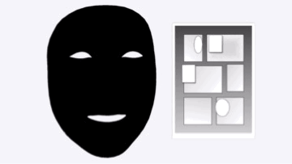

ポートフォリオ
============

iPhone中心にAppleプラットフォーム向けアプリを開発/公開しています。全作業を自分1人で行っています。

各アプリは無料で利用できます。ぜひ実際にアプリをインストールして触れてみて下さい。

* * *

### Plain将棋盤

__全てのAppleプラットフォームに対応__

OS標準デザインに準拠したシンプルかつ軽量で多機能な将棋盤アプリ

SwiftUIのポテンシャルを最大限活かしました。各プラットフォームに対してそれぞれしっかりと最適化を行った上で、全てのAppleプラットフォーム(iPhone/iPad/Mac/Apple TV/Apple Watch/Apple Vision Pro)へリリースしました。

SharePlayに対応しているので遠くの友人とも近くの家族とも将棋盤を囲むことが出来ます。

主要フレームワーク: SwiftUI, GroupActivities

[__App Storeリンク__](https://apps.apple.com/app/id1620268476)

[PRページリンク](Plain将棋盤/ja)

[ソースコードリンク(GitHub)](https://github.com/FlipByBlink/PlainShogi)

* * *

### 暗記ウィジェット(iPhone/iPad/Mac/Apple Watch)

ホーム画面やロック画面、デスクトップ、文字盤を暗記帳にするアプリ

世界中のユーザーから非常に高い評価を得ており、ヘビーユーザーを一定数獲得しています。

主要フレームワーク: SwiftUI, WidgetKit

[__App Storeリンク__](https://apps.apple.com/app/id1644276262)

[PRページリンク](MemorizeWidget/ja)

[ソースコードリンク(GitHub)](https://github.com/FlipByBlink/MemorizeWidget)

* * *

### FlipByBlink(iPhone/iPad)

まばたきだけで読書ができる電子書籍アプリ

大学の卒業研究で取り組んだアイデアです。2019年1月に初版をリリースしました。

主要フレームワーク: UIKit, Auto Layout, ARKit, PDFKit

[__App Storeリンク__](https://apps.apple.com/app/id1444571751)

[PRページリンク](FlipByBlink/ja)

[ソースコードリンク(GitHub)](https://github.com/FlipByBlink/FlipByBlink_ver3)

* * *

### 体重登録(iPhone/iPad/Apple Watch)

iPhoneやiPadにプリインストールされている「ヘルスケア」アプリに体重データを(手動としては)最速で登録するためのアプリ

同コンセプトのアプリはApp Storeに多くありますが、本アプリは同コンセプトにおいて機能面/デザイン面でベストであると自負しています。

主要フレームワーク: SwiftUI, HealthKit

[__App Storeリンク__](https://apps.apple.com/app/id1624159721)

[PRページリンク](TapWeight/ja)

[ソースコードリンク(GitHub)](https://github.com/FlipByBlink/TapWeight)

* * *

### HandsRuler(Apple Vision Pro)

両手で距離を直感的に測定できる物差しアプリ

Apple Vision Pro発売日である2024年2月2日にリリースしました。

主要フレームワーク: ARKit, RealityKit, SwiftUI

[__App Storeリンク__](https://apps.apple.com/app/id6475769879)

[PRページリンク](HandsRuler/ja)

[ソースコードリンク(GitHub)](https://github.com/FlipByBlink/HandsRuler)

* * *

#### 体温登録(iPhone/iPad/Apple Watch)
iPhoneやiPadにプリインストールされている「ヘルスケア」アプリに体温データを(手動としては)最速で登録するためのアプリ

[__App Storeリンク__](https://apps.apple.com/app/id1626760566)

* * *

#### ロックノート(iPhone/iPad/Mac/Apple Watch)
「ウィジェット」に特化した超軽量なノートアプリ

[__App Storeリンク__](https://apps.apple.com/app/id1644879340)

* * *

#### FadeInAlarm(iPhone/iPad)
時間をかけて少しずつ音が大きくなるアラームアプリ

[__App Storeリンク__](https://apps.apple.com/app/id1465336070)

* * *

#### SpatialClock(Apple Vision Pro)
空間コンピューティング用の置き時計アプリ

[__App Storeリンク__](https://apps.apple.com/app/id6476141176)

* * *

## ソースコード公開
アプリのソースコードはGitHub上で全て公開しています。

[GitHubアカウントページリンク](https://github.com/FlipByBlink)

* * *

## 技術ブログ記事

[「残念な」iPadアプリをわずかな修正で折り合いをつけるテクニック2選](https://zenn.dev/huiygfutfgvjknj/articles/eea68b91b7306c)

[非日本語圏日本語フォント問題、SwiftUIにおける対処事例(2023年中旬) #Swift - Qiita](https://qiita.com/mjnfhbuvwebwfiejcnw/items/c9961f8ba6c366953752)

[中華フォントをたった1行で解決するtypesettingLanguage【SwiftUI】 #Swift - Qiita](https://qiita.com/mjnfhbuvwebwfiejcnw/items/2e6c3cdec8b2934e9e99)

[iPhoneアプリをiPad対応するノリでMac対応しよう【SwiftUI】 #iOS - Qiita](https://qiita.com/mjnfhbuvwebwfiejcnw/items/df8ca3b867b0708226b6)

[Mac Catalystアプリを良い感じにする固有テクニック2(+6)選](https://zenn.dev/huiygfutfgvjknj/articles/67072b942d767c)
