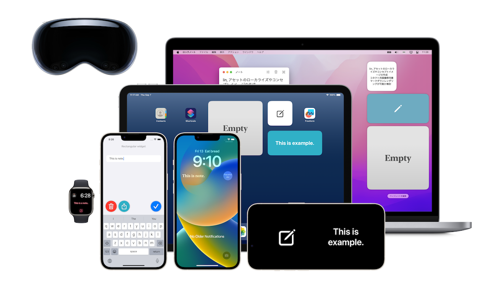

ポートフォリオ
============

iPhone中心にAppleプラットフォーム向けにアプリを制作しています。全作業を自分1人で行っています。

各アプリは無料で利用できます。ぜひ実際にアプリをインストールして触れてみて下さい。

* * *

__PlainShogiBoard / Plain将棋盤__

iPhone/iPad/Mac/Apple TV/Apple Watch向けアプリ

OS標準デザインに準拠したシンプルかつ軽量で多機能な将棋盤アプリ。SharePlay対応。

主要フレームワーク: SwiftUI, GroupActivities

SwiftUIのポテンシャルを最大限活かす。各プラットフォームに対してそれぞれ最適化を行った上で、全てのAppleプラットフォームへリリース。Apple Vision Pro対応予定。

[PRページ](Plain将棋盤/ja)

* * *

__TapWeight__

iPhone/iPad/Apple Watch向けアプリ

iPhone/iPadにプリインストールされている「ヘルスケア」アプリに体重データを(手動としては)最速で登録するためのアプリ

主要フレームワーク: SwiftUI, HealthKit

同コンセプトのアプリはAppStoreに沢山ありますが、本アプリは同コンセプトにおいて機能面/デザイン面でベストであると自負。

[PRページ](TapWeight/ja)

* * *

__TapTemperature__

iPhone/iPad/Apple Watch向けアプリ

iPhone/iPadにプリインストールされている「ヘルスケア」アプリに体温データを(手動としては)最速で登録するためのアプリ

主要フレームワーク: SwiftUI, HealthKit

[PRページ](TapTemperature/ja)

* * *

__MemorizeWidget__

ホーム画面やロック画面、デスクトップを暗記帳にするアプリ。

[PRページ](MemorizeWidget/ja)

* * *

__LockInNote__

「ウィジェット」に特化したノートアプリ。

[PRページ](LockInNote/ja)

* * *

__FlipByBlink__

iPhone/iPad向けアプリ

まばたきだけで読書ができる電子書籍アプリ。

主要フレームワーク: UIKit, Auto Layout, ARKit, PDFKit

大学の卒業研究で取り組んだアイデア。2019年1月に初版をリリース。

[PRページ](FlipByBlink/ja)

* * *

__FadeInAlarm__

時間をかけて少しずつ音が大きくなるアラームアプリ。

[PRページ](FadeInAlarm/ja)
